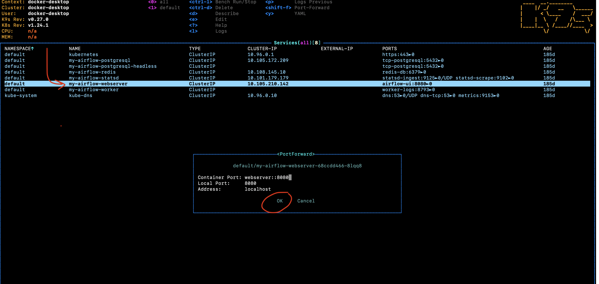
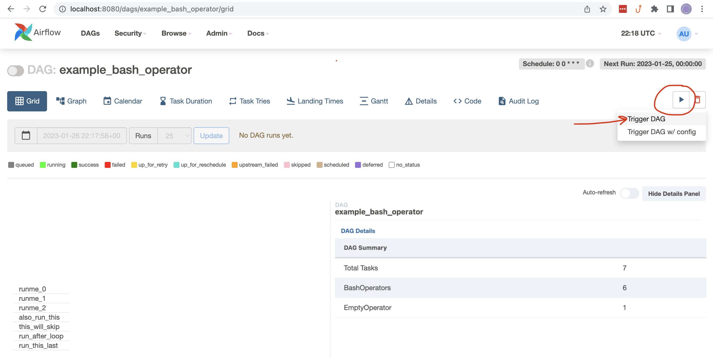
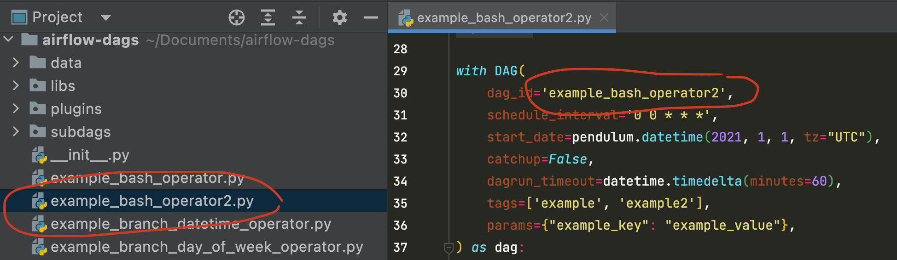
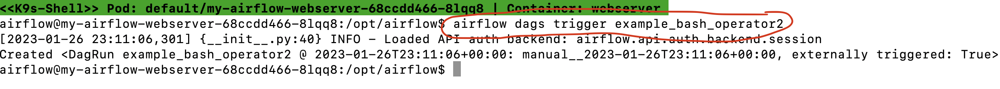

# Run Airflow 2 Locally

According to the official [Airflow Installation](https://airflow.apache.org/docs/apache-airflow/stable/installation/index.html#) docs, there are several ways to install Airflow 2 locally. To encourage standardization of local environments at Avant, we offer our own instructions for installing Airflow.

## Prerequisites

### \[Optional\] Install your preferred package manager

- [Homebrew](https://brew.sh/) (macOS, Linux)
- [Scoop](https://scoop.sh/) (Windows)
- [Chocolatey](https://chocolatey.org/install) (Windows)

### Install K9s

**macOS**

```bash
# Via Homebrew
brew install derailed/k9s/k9s

# Via MacPort
sudo port install k9s
```

**Linux**

```bash
# Via LinuxBrew
brew install derailed/k9s/k9s

# Via PacMan
pacman -S k9s
```

**Windows**

```bash
# Via Scoop
scoop install k9s

# Via Chocolatey
choco install k9s
```

### Install Helm

**macOS**

```bash
# Via Homebrew
brew install helm

# Via MacPort
sudo port install helm-3.11
```

**Linux**

```bash
# Via LinuxBrew
brew install helm

# Via PacMan
pacman -S helm
```

**Windows**

```bash
# Via Scoop
scoop install helm

# Via Chocolatey
choco install kubernetes-helm
```

### Install Docker Desktop

Install [Docker Desktop](https://www.docker.com/products/docker-desktop/), and use your Avant email to create a Docker account.

### Install slice

`git clone https://github.com/AvantFinCo/slice.git`

Follow the instructions in the `slice` README to install `slice` on your local machine.

I recommend creating a virtual environment and activating it before starting `slice` so that it puts Ansible things in the right place.

### Start Slice

Don't forget to `slice up` before continuing!

### Complete Airflow 2 installation

Change `airflow-volume.yml` `spec.hostPath.path` to be where you want example-dags stored on your local machine

Then run the install script

```bash
./deploy_avant_image_with_helm.sh
```

You should now have an installed Airflow chart (with release name "airflow" and namespace "airflow"). Confirm this by running `helm list -n airflow`.

```
NAME    NAMESPACE       REVISION        UPDATED                                 STATUS          CHART           APP VERSION
airflow airflow         1               2023-11-13 12:43:52.013211 -0600 CST    deployed        airflow-1.11.0  2.7.1
```

Do note the namespacing of the release. This is important when looking for information. I moved airflow into its own namespace to make it easier to wipe it away and start over.

## Ok Now What?

### Open a new terminal and run `k9s`

```bash
k9s
```

If you don't see anything then type`:namespace`, hit `<Enter>`, and you should see `airflow` as a namespace.

**NOTE**: You can switch between the kubernetes and celery executors by updating the `values.yml` file.

### "Port-Forward" `my-airflow-webserver`

- Scroll down to `my-airflow-webserver` service
- Type `<shift>` + `<f>`
- Select `OK`



### Open the Airflow UI

- In your web browser, go to [http://localhost:8080/home](http://localhost:8080/home)
- Log into Airflow with username "admin" and password "admin"

- You might have to exec into the webserver and run `airflow users  create --role Admin --username admin --email admin --firstname admin --lastname admin --password admin
`

### Do stuff

**Select an existing DAG and trigger it from the UI**

- Click on DAG in the home page
- Click "play" button in the DAGs page



**Create a new DAG and trigger it from the command line**

- Create new python script (**REMEMBER**: DAG files are stored in `Wherever you configued it in airflow-volume.yml`)
- In `k9s`, select `my-airflow-webserver` service (using `<return>`)
- Access the shell of the running pod (using `<s>`)
- Run `airflow dags trigger <new_dag_id>`





**NOTE**: You can exit out of the `k9s` shell by running the `exit` command, and you can "back out" of `k9s` filters by using `<esc>`.

**ref**: https://github.com/airflow-helm/charts/tree/main/charts/airflow#frequently-asked-questions
